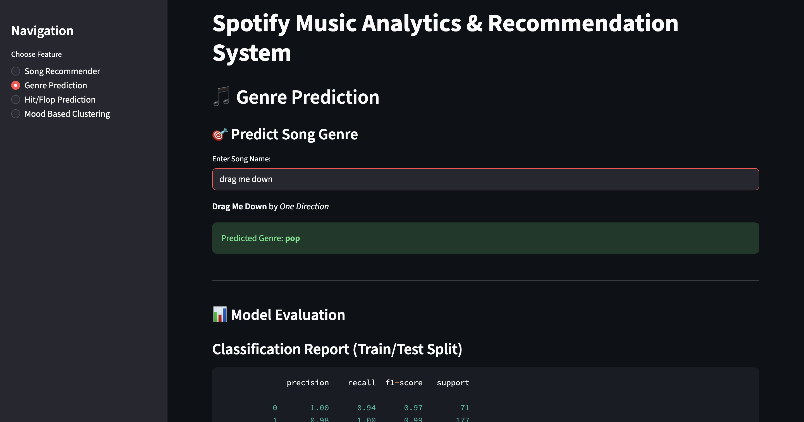

# Spotify Music Analytics & Recommendation System

A multi-feature music ML web app built with **Streamlit**, using Spotify audio features. It includes **mood-based clustering**, a **content-based recommender**, **genre classification evaluation**, and **hit/flop prediction** — all integrated into an interactive dashboard.

---

## Features

### 1. Content-Based Song Recommender

Given a song you like (track + artist), the system:

- Finds similar songs using **cosine similarity** on audio features
- Recommends **5 most similar songs**
- Handles edge cases like:
  - Song not found
  - Duplicates (filtered out)
  - Multiple versions of a track

#### Streamlit Dashboard

  

---

### 2. Genre Prediction

Performs genre prediction using **XGBoost** on 9 popular genres including:
['alternative', 'ambient', 'chill', 'dubstep', 'edm', 'house', 'indie', 'pop', 'sad']

Features:
- Predicts the genre of a song from the dataset
- Displays a full classification report
- Displays 5-Fold Cross Validation scores (F1 Weighted)

#### Streamlit Dashboard

 

---

### 3. Hit/Flop Classification

A binary classifier trained using **Random Forest** to predict whether a song is a **Hit (popularity ≥ 60)** or a **Flop**.

- Includes:
  - Full classification report 
  - Probability of being a "Hit"

#### Hit Guessing Feature
- Enter a song name
- The model pulls its features, predicts whether it's a **hit or flop**, and shows the **confidence score**
- Handles:
  - Multiple versions 
  - Song not found 

#### Streamlit Dashboard

  

---

### 4. Mood-Based Clustering

Uses **KMeans** clustering with audio features like `valence`, `energy`, `danceability`, etc. to group songs into different **mood clusters**.

- The optimal number of clusters was determined during experimentation using the **Elbow Method**.
- Assigns descriptive labels like `"Chill"`, `"High Energy"`, `"Sad"`, etc.

#### Streamlit Dashboard

---

## Note:

- Recommender is based on similarity only — not collaborative filtering.
- Model performance may vary with the quality/diversity of the dataset.

---

## Acknowledgments

- Dataset: Filtered Spotify Tracks from Kaggle
- Inspiration: Real-world ML deployment with music data

